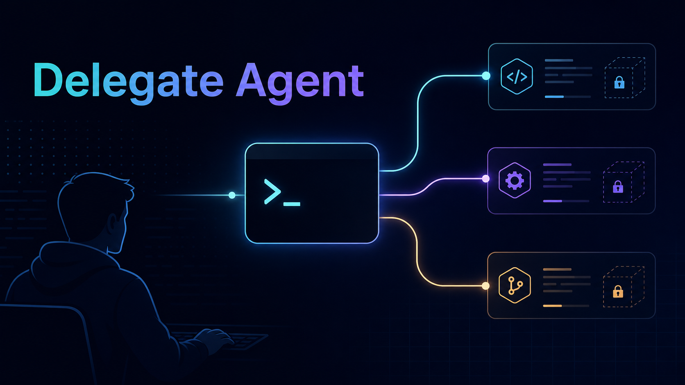

<p align="center">
  
</p>

# Delegate Agent

Delegate Agent is a small CLI for handing a bounded task to another coding-agent runtime. It normalizes common calls to Cursor Agent, Factory Droid, OpenAI Codex, Claude Code, Grok Build, Devin, OpenCode, and Kimi Code so humans or other agents can launch review, investigation, and implementation jobs without remembering each tool's flags.

Use it when you want a predictable wrapper around prompts like:

- "Review this diff and report risks. Do not edit."
- "Investigate this failure in an isolated copy."
- "Implement this scoped change, run the named check, and report changed files."

Delegate does **not** commit, push, merge, deploy, publish, or run a background service. It builds the child command, adds safety framing, launches the selected runtime, and records local run metadata for later inspection.

Prompt handling is provider-specific: Codex, Claude, and OpenCode prompts are delivered to the child
runtime over stdin; Droid, Grok, and Devin prompts are delivered through private
temporary prompt files; Cursor Agent and Kimi Code currently
require prompt argv. Delegate redacts Cursor and Kimi prompt argv in dry-run
output and run manifests, but true process-argv hiding for those harnesses
depends on the child CLIs exposing stdin or prompt-file transport.

## Install

Delegate requires Python 3.11 or newer. The PyPI package is named `delegate-agent-cli` (PyPI's name-similarity rule blocked the shorter `delegate-agent`), but it installs the same `delegate` command either way.

```bash
uv tool install delegate-agent-cli
# or
pipx install delegate-agent-cli
# or
pip install delegate-agent-cli
```

### Install from source

For the latest unreleased code, or to contribute:

```bash
python3 -m pip install "delegate-agent-cli @ git+https://github.com/treygoff24/delegate-agent.git"
```

For local development or a checkout-only smoke test:

```bash
git clone https://github.com/treygoff24/delegate-agent.git
cd delegate-agent
python3 -m venv .venv
. .venv/bin/activate
python -m pip install -e .
python3 bin/delegate.py --json describe
```

CI currently validates on Linux with Python 3.11, 3.12, 3.13, and 3.14. Windows support is not claimed until it is covered by tests.

## Prerequisites

Delegate wraps other CLIs. Install and authenticate only the runtimes you plan to call:

```bash
command -v agent   # Cursor Agent CLI (default model: Cursor Composer), used by delegate cursor ...
command -v droid   # Factory Droid CLI, used by delegate droid ...
command -v codex   # OpenAI Codex CLI, used by delegate codex ...
command -v claude  # Claude Code CLI, used by delegate claude ...
command -v grok    # xAI Grok Build CLI, used by delegate grok ...
command -v devin   # Cognition Devin CLI, used by delegate devin ...
command -v opencode # OpenCode CLI, used by delegate opencode ...
command -v kimi    # Kimi Code CLI, used by delegate kimi ...
```

Runtime authentication is owned by each child CLI. Delegate cannot log in for you. Dry-runs and CI tests do not require the real child binaries.

Install OpenCode from [opencode.ai](https://opencode.ai). Its curl installer
normally writes the binary to `~/.opencode/bin`, which may not be on `PATH`.
Extend `PATH` or set `opencode.binary` to the absolute binary path.

Initialize a starter config and replace placeholder Droid model IDs before real Droid runs:

```bash
delegate config init
$EDITOR ~/.delegate/config.json
```

`config init` also writes missing `~/.delegate/config.work.json` and
`~/.delegate/config.personal.json` profile overlays. For an existing install,
run `env -u AI_PROFILE delegate config sync-profiles` to materialize any missing
overlays without overwriting ones you already edited.

Inspect what Delegate sees:

```bash
delegate --version       # installed version — include this in bug reports
delegate --json describe --summary
delegate --json models --summary
delegate --json describe
delegate --json models
delegate --json models codex          # per-engine advisory catalog
delegate --json models cursor --live  # merge live harness probe when supported
delegate --json models opencode --live # query every model visible to OpenCode
delegate --json capabilities
```

Discover commands as you go: `delegate <command> --help` prints focused help for any command path, and `delegate --json <command> --help` returns an agent-friendly spec of its usage, arguments, and options. For launch and `dry-run` commands, `--json` and `--isolation` may also appear before inline prompt text begins, for example `delegate codex work --prompt-file task.md --json`. `delegate --json describe` includes a `commands` catalog of the whole surface. `delegate --json capabilities` reports reasoning-effort support without launching a child runtime.

From this development checkout, use `python3 bin/delegate.py ...` instead of an installed `delegate` shim.

### WSL setup notes

Delegate is a POSIX/Linux CLI and works best in WSL when everything is WSL-native:

- Install Python, Git, Delegate, and child CLIs inside the WSL distro.
- Keep projects under `/home/<user>/...`; `/mnt/c/...` works but can be slower and has weaker private-file permission semantics.
- Pass POSIX paths (`/home/...` or `/mnt/c/...`), not Windows paths like `C:\Users\...`; use `wslpath -u` to convert.
- If `git` resolves to Windows `git.exe`, Delegate fails with a targeted hint. Install WSL Git, for example `sudo apt install git`.

## Quickstart

Preview the command without launching a child runtime:

```bash
delegate --json dry-run codex safe "Review this repository. Do not edit files."
delegate --json dry-run claude safe "Review this repository. Do not edit files."
delegate --json dry-run opencode safe "Review this repository. Do not edit files."
```

Run a read-only review in an isolated throwaway workspace:

```bash
delegate codex safe "Review this repository for correctness risks. Do not edit files."
delegate claude safe "Review this repository for correctness risks. Do not edit files."
delegate grok safe "Review this repository for correctness risks. Do not edit files."
delegate devin safe "Review this repository for correctness risks. Do not edit files."
delegate opencode safe "Review this repository for correctness risks. Do not edit files."
delegate cursor safe "Review the current diff for regressions. Do not edit files."
delegate kimi safe "Review this repository for regressions. Do not edit files."
```

Review uncommitted local changes without committing first or pasting a diff — safe mode mirrors your working tree into the isolated copy:

```bash
# Edit files locally, then launch safe review as-is:
delegate codex safe "Review my uncommitted changes for regressions. Do not edit files."
```

Run an edit-capable task in a workspace you trust:

```bash
delegate cursor work "Fix the parser bug. Run python3 -m unittest tests.test_delegate_parser. Report changed files."
delegate claude work "Implement the scoped change and run the named check. Report changed files."
delegate devin work "Implement the scoped change and run the named check. Report changed files."
delegate opencode work "Implement the scoped change and run the named check. Report changed files."
delegate kimi work "Implement the scoped change and run the named check. Report changed files."
```

Pin a model per run with `--model` (config alias from `<engine>.models`, or a
raw model ID passed through verbatim). Droid still accepts a positional alias;
`--model` works on every engine, including Droid:

```bash
delegate devin safe --model claude-fable-5 "Review this repository. Do not edit files."
delegate droid work --model custom:my-model "Implement the scoped change."
delegate --json dry-run codex safe --model fast "Review this repository. Do not edit files."
```

For long foreground runs, add `--progress` to emit bounded parent heartbeats to
stderr while keeping final stdout machine-readable, or set `progress.enabled`
to `true` in config. Use `--no-progress` to override config for one launch.
Heartbeat labels are credential-scrubbed before printing but are still
operational metadata, not raw child output:

```bash
delegate --json claude safe --progress "Review this repository. Do not edit files."
```

Run through JSON input for agent callers after copying an example and setting a real `cwd`:

```bash
cp examples/task.codex.json /tmp/delegate-task.json
$EDITOR /tmp/delegate-task.json
delegate --json run --input-json /tmp/delegate-task.json
```

For Codex fan-outs that must return machine-parseable records, add `--output-schema` (or JSON `outputSchema`); Delegate suppresses completion-report injection so the schema owns the final message.

For a one-hop prompt that should not see the current repo or create a tracked
run, use stateless `call` mode:

```bash
delegate --json codex call "Summarize this context in three bullets."
```

For multi-step fan-out or gated review flows, use Delegate Workflows. A workflow
is a Python script that launches normal Delegate child runs, journals progress,
can pause on approval gates, and can resume from cached child results:

```bash
python3 bin/delegate.py workflow check review.py
python3 bin/delegate.py --json workflow run review.py --args '{"files":["src/cli.py"]}' --budget 10
python3 bin/delegate.py workflow approve wf_0123abcdef45
```

See [Delegate Workflows](docs/delegate-workflows.md) for the DSL, safety
limits, config, and gate semantics.

Reasoning effort is provider-aware. Unsupported combinations fail before launch. It changes only the requested model thinking depth/cost/latency; it does not change safe/work/call mode, sandboxing, approvals, or edit capability. Codex/Droid validate effort against model capability metadata, Cursor maps effort to configured model selection, Claude maps to Claude Code `--effort`, and OpenCode passes it through as `--variant`. Grok maps to `--effort` with model-aware validation: `grok-4.5`, unresolved harness defaults, and unknown/raw model IDs use the conservative `low`, `medium`, `high` set; `grok-composer-2.5-fast` also accepts `xhigh` and `max`. Devin and Kimi do not expose a Delegate reasoning-effort flag. Explicit Codex effort can target the harness default model even when `codex.defaultModel` is unset:

```bash
delegate --json dry-run codex safe --reasoning-effort high "Review this repository. Do not edit files."
delegate --json dry-run claude safe --reasoning-effort high "Review this repository. Do not edit files."
```

Codex model routing is deliberately model-first rather than aliasing every
model/effort pair: define model aliases in `codex.models`, then set effort per
run with `--reasoning-effort`. Per-model effort menus (including any efforts
newer than the bundled data) belong in the private `reasoning.capabilities`
config block, which overrides the bundled defaults.

Fast mode is an independent per-run serving choice. `--fast` requests Codex's
Fast service tier, `--no-fast` explicitly requests Standard, and omitting both
inherits the active Codex configuration:

```bash
delegate codex safe --model my-alias --reasoning-effort medium --fast "Explore likely causes."
delegate codex work --model my-alias --reasoning-effort high --no-fast "Implement and verify."
```

Inspect tracked output by alias:

```bash
delegate runs --recent
delegate snapshot <alias-or-runId>
delegate run-output <alias-or-runId>
```

Aliases are always numbered (`codex-1`, `cursor-2`); a **bare harness name
resolves to the latest matching run**, so `delegate run-output codex` reads the
newest codex run and `delegate run-output codex:glm` the newest matching
model. Envelopes echo `requestedHandle`/`resolvedHandle`/`resolutionKind` so you
can confirm which run you addressed.

`run-output` defaults to the best available parent-facing output: a completion
report when present, a recovered final assistant message when possible, or
bounded stdout/stderr diagnostics. Use `--completion-report` when you want that
selector explicitly. Tracked runs also carry a `resultQuality` classification
(`ok` / `housekeeping_noop` / `empty` / `suspect_short` / `no_assistant_text`),
and failed or cancelled runs always get a completion report — synthesized when
the child produced none — so `--completion-report` never dead-ends.

Block on background runs instead of polling, and cancel them cleanly:

```bash
delegate wait <alias-or-runId>... [--group NAME] [--timeout SEC] [--completion-report]
delegate cancel <alias-or-runId>
```

`wait` uses effective status (a dead child is a terminal failure, not a hang)
and exits `0` when all waited runs succeeded, `1` when any failed or was
cancelled, and `124` on timeout. `cancel` signals the run's process group
(SIGTERM, a short grace period, then SIGKILL) with terminal/stale refusal and a
start-identity check against PID reuse; a cancelled run reports `cancelled`
rather than a false success. Tag a batch of launches with `--group NAME` and
`wait`, `runs`, and the worktree commands can select the whole group at once.

## Task design: cluster related work into fewer, richer delegations

When splitting a project across delegated runs (or any subagents), fewer workers with clustered, related tasks consistently outperform wide fan-outs of narrow siloed tasks. Modern child runtimes carry very large context windows — the scarce resource is coherence across related tasks, not tokens.

- Cluster tasks that share files, schemas, or design trade-offs into one delegation. A single worker that holds the whole entangled cluster can reason about the interactions between its tasks and make globally consistent choices; several siloed workers each make locally reasonable decisions that collide at the seams.
- Fan out only across genuinely independent units: disjoint file ownership, no shared design decisions, results that do not need to agree with each other.
- Brief the clustered worker generously. Include the full findings or spec, the decisions already made, and how the tasks relate — context that lets it weigh trade-offs *between* its tasks is the point of clustering.

## Safe mode, work mode, and worktree isolation

Delegate separates three ideas:

| Concept | Meaning |
| --- | --- |
| Mode | `safe` is for review/investigation; `work` is edit-capable; `call` is a stateless one-hop model call. |
| Isolation | The child runtime can run in the source workspace, a temporary copy/worktree, or a persistent Git worktree. |
| Runtime policy | Extra flags passed to the child runtime, such as Codex `--sandbox read-only`. |

Defaults are intentionally conservative for review paths:

- `delegate cursor safe`, `delegate codex safe`, `delegate claude safe`, `delegate grok safe`, `delegate devin safe`, `delegate opencode safe`, `delegate droid ALIAS safe`, and `delegate kimi safe` run in an isolated throwaway workspace. Safe mode reviews your **current working tree** — uncommitted tracked edits and untracked, non-ignored files are mirrored into an isolated throwaway copy (only gitignored paths are excluded), so you can review local changes without committing first or pasting a diff.
- Grok safe mode uses Delegate isolated copy plus Grok read-only sandbox/permission controls (`--sandbox read-only`, `--permission-mode dontAsk` by default). It does not use Grok `plan` mode. Prompts are delivered via Grok `--prompt-file` from a Delegate temp file.
- Devin safe mode uses Delegate isolated copy plus a Delegate-generated `--agent-config` deny-list for edit/write/exec and `mcp__*`, with Devin `--permission-mode auto`. Work mode uses Devin `--permission-mode dangerous` because Devin print mode rejects unapproved edit/exec tools.
- OpenCode safe mode uses Delegate's isolated copy plus an `OPENCODE_CONFIG_CONTENT` permission lockdown that allows only read, glob, and grep operations. OpenCode merges this override last, so repository configuration cannot restore write-capable tools. `opencode call --read-only` uses the same lockdown; plain `call` does not.
- Claude safe mode invokes `claude -p` with prompt text on stdin, `--permission-mode plan`, `--strict-mcp-config`, Read/Grep/Glob plus selected read-only Bash tools, and `--no-session-persistence` by default. Delegate does not currently prove that Claude Code hooks, plugins, user settings, or other non-MCP customization surfaces are disabled.
- `work` mode can edit. By default it runs in the real workspace for backward compatibility.

For edit-capable isolation, use a persistent Git worktree:

```bash
delegate --isolation worktree cursor work "Implement the scoped change and run the named check."
delegate --isolation worktree cursor work --forbid-commit "Implement the scoped change without creating commits."
delegate worktree list
delegate worktree show <alias-or-runId>
delegate worktree remove <alias-or-runId>
```

Worktree isolation protects the source checkout from ordinary relative-path edits. It is **not** a full security sandbox; the child process can still use its runtime permissions, credentials, network access, and absolute paths according to the environment and runtime policy.

Persistent worktree completions and `worktree list/show` include a work summary
with dirty state, changed file counts, diff stat, and commits created by the
child where that summary is available. `--forbid-commit` fails the run if
commits remain ahead of the creation base when the child exits, and it now
implies `--isolation worktree`.

To carry uncommitted local work into the worktree instead of stashing it, add
`--include-dirty`: it syncs tracked edits and untracked, non-ignored files into
the worktree through the same snapshot primitives as safe mode, and tears the
worktree down before launching the child if that sync fails.

Safe isolation and `--include-dirty` recreate an untracked symlink only when it is relative, resolves inside the source workspace, and its target is not gitignored; any symlink that fails those checks — an absolute target, an escape out of the tree, or a target that is itself a gitignored secret — is replaced with an inert placeholder file, failing closed on any ambiguity. Delegate reports a warning listing the symlink paths it blocked. In Git repositories with no commits yet, Cursor/Codex/Claude/Droid/Grok/Devin/OpenCode/Kimi safe isolation falls back to a directory copy because Git cannot create a detached worktree from an unborn `HEAD`.

Snapshots and `run-output` redact common credential shapes by default, including authorization headers, bearer/basic tokens, JWT-like strings, and common `token=` / `api_key=` / `password=` values. Use `--no-redact` only when exact output is necessary and safe to display.

## Profile-aware auth and env

A **profile** selects which credentials and environment every delegated harness inherits, so one session can run under, say, a work account and another under a personal account without editing config between runs. Define profiles under the top-level `profiles` block, then either let Delegate detect the active one from an environment variable (`profiles.detectFrom`) or pin it explicitly with `--auth-profile NAME`:

```bash
delegate --json --auth-profile work profiles    # inspect the resolved profile (read-only)
delegate --auth-profile work codex safe "Review this diff."
```

Delegate resolves the profile once per request and injects its env into every spawned child across tracked, pass-through, safe-isolation, and persistent-worktree paths. Profile `env` holds **non-secret routing pointers only** (for example `CODEX_HOME`); secret-shaped keys are rejected at config load, so real credentials stay in your shell or a harness-native key store. See [Configuration](docs/configuration.md#profiles) for the full schema.

If `AI_PROFILE=work|personal` points at a missing profile overlay, Delegate
blocks launch and mutation commands, but lets read-only diagnostics
(`profiles`, `runs`, `run-output`, `snapshot`, cached `capabilities`,
`worktree show`, `worktree list`, `describe`, `models`) continue with a
warning. This guarantee is enforced in the Python CLI itself (`delegate_agent.cli:main`), so it holds no matter how you invoke Delegate: the
pip console script, `python -m delegate_agent.cli`, `bin/delegate.py`, or a
shell shim in front of any of those. The tracked launcher shim template,
`bin/delegate-profile-shim`, applies the same check earlier, before Python
even starts, as an additional early gate. Temporary bypasses: `env -u
AI_PROFILE delegate ...` uses the base config, or set
`DELEGATE_CONFIG=/path/to/config.json`.

## Useful docs

- [Agent setup](docs/agent-setup.md): human and non-interactive setup flows.
- [CLI reference](docs/cli-reference.md): commands, exit codes, and JSON contracts.
- [Configuration](docs/configuration.md): config precedence, sections, and provider-neutral aliases.
- [Delegate Workflows](docs/delegate-workflows.md): workflow DSL, caps, config, and gate semantics.
- [Security model](docs/security-model.md): boundaries, limitations, and safe usage.
- [Worktrees](docs/worktrees.md): persistent-worktree lifecycle and cleanup.
- [Troubleshooting](docs/troubleshooting.md): common failures and checks.
- [Contributing](CONTRIBUTING.md) and [Security](SECURITY.md).

## Limitations

- Delegate is an alpha CLI wrapper. Child runtimes can change their own flags or behavior.
- Safe mode is a policy and isolation pattern, not a guarantee that a runtime cannot perform side effects outside its execution workspace.
- Persistent worktrees require a Git repository with a valid `HEAD`; work-mode worktree runs require a clean source checkout.
- `--pass-through` is incompatible with `--json` and with persistent worktree runs.
- Delegate stores local run metadata under `.delegate/`; do not commit that directory.
