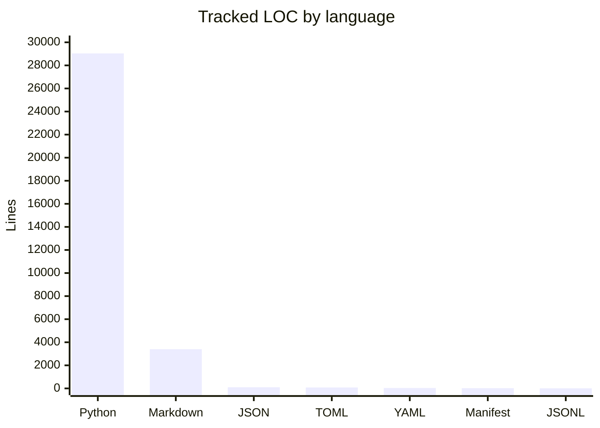

# By the numbers

Data collected on 2026-06-18 from tracked files and git history only. File category totals exclude docs assets. The repository was on branch `main` at `5eb8824b212a513ee22eeec941812aa863c774da`.

## Language breakdown

Total counted tracked LOC: 32,692.

| Language | LOC | Share |
| --- | ---: | ---: |
| Python | 29,040 | 88.8% |
| Markdown | 3,399 | 10.4% |
| JSON | 100 | 0.3% |
| TOML | 83 | 0.3% |
| YAML | 38 | 0.1% |
| Manifest | 22 | 0.1% |
| JSONL | 10 | 0.0% |

## Size

| Metric | Count |
| --- | ---: |
| Tracked files, excluding docs assets | 80 |
| Source files | 29 |
| Test files | 22 |
| Documentation files | 17 |
| Config files | 7 |
| Other files | 5 |
| Source LOC | 13,334 |
| Test LOC | 15,716 |
| Test to source LOC ratio | 1.18x |

Largest Python files include `src/delegate_agent/cli.py` at 4,042 lines, `tests/test_delegate_execution.py` at 3,360 lines, `tests/test_delegate_worktree_mgmt.py` at 2,093 lines, and `src/delegate_agent/worktree_mgmt.py` at 1,712 lines.

## Activity

The repository has 121 commits through the current HEAD. Recent commit counts were 28 in 2026-W21, 43 in 2026-W22, 14 in 2026-W23, 16 in 2026-W24, and 20 in 2026-W25.

Release tags moved quickly: `v0.1.3` on 2026-06-05, `v0.1.4` on 2026-06-08, `v0.2.0` on 2026-06-09, `v0.3.0` and `v0.3.1` on 2026-06-12, `v0.4.0` on 2026-06-15, and `v0.5.0` on 2026-06-18.

## Bot-attributed commits

Bot-attributed commits found in history: 0. That is 0 of 121 commits, or 0.0%. This is a lower bound on AI-assisted work because inline coding tools usually do not leave bot co-author metadata in git history.

## Complexity

| Signal | Evidence |
| --- | --- |
| One-file orchestration concentration | `src/delegate_agent/cli.py` is 4,042 lines and appears in 56 commits in the last 90 days. |
| Worktree lifecycle weight | `src/delegate_agent/worktree_mgmt.py` is 1,712 lines and appears in 29 commits in the last 90 days. |
| Execution behavior coverage | `tests/test_delegate_execution.py` is 3,360 lines and appears in 28 commits in the last 90 days. |
| Worktree behavior coverage | `tests/test_delegate_worktree_mgmt.py` is 2,093 lines and appears in 27 commits in the last 90 days. |
| Marker debt | 0 tracked TODO, FIXME, or HACK comments. |

See [cleanup opportunities](cleanup-opportunities/index.md) for maintenance notes tied to these numbers.
