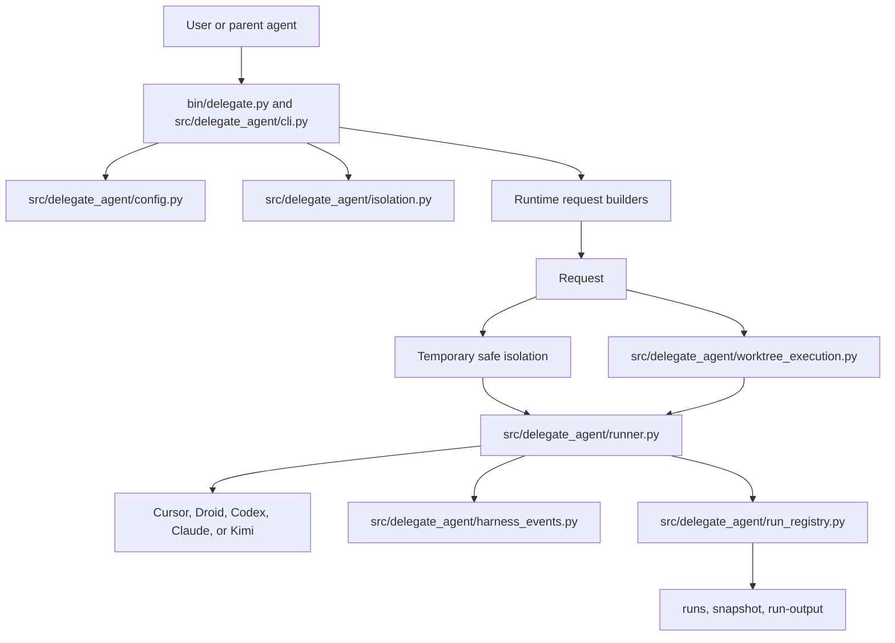
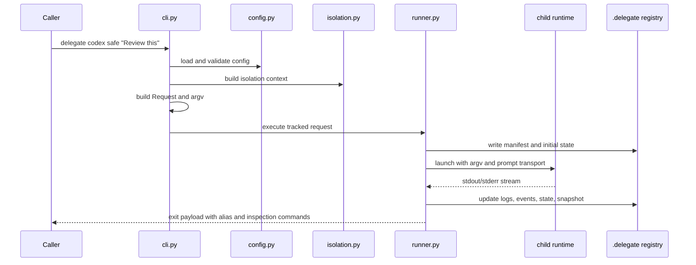
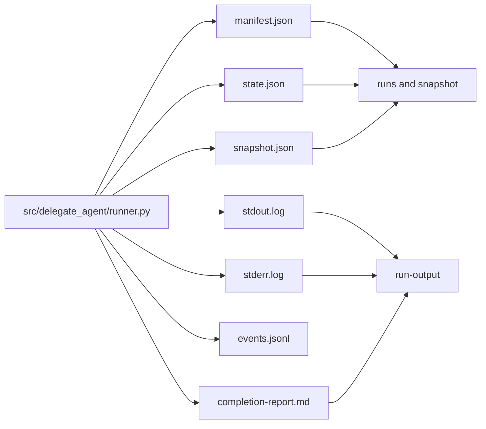

# Architecture

Delegate is a single Python package with a CLI front door, runtime-specific request builders, an execution recorder, and a local registry. The code is mostly stdlib-only Python, with packaging and dev tooling configured in `pyproject.toml`.

## High-level flow

The entry point in `bin/delegate.py` delegates to `src/delegate_agent/cli.py`. That module parses commands, loads config through `src/delegate_agent/config.py`, resolves workspace and isolation metadata, builds a `Request`, and hands execution to either `src/delegate_agent/runner.py` or `src/delegate_agent/worktree_execution.py`.

## Core components

| Component | Main files | Responsibility |
| --- | --- | --- |
| CLI orchestration | `src/delegate_agent/cli.py`, `src/delegate_agent/command_help.py` | Parse commands, build requests, render help, dispatch subcommands. |
| Config and policy | `src/delegate_agent/config.py`, `config.example.json` | Merge config layers, validate provider sections, resolve policy and isolation defaults. |
| Runtime harnesses | `src/delegate_agent/cli.py`, `src/delegate_agent/prompt_transport.py`, `src/delegate_agent/prompt_instructions.py` | Build child argv and prompt transport for each runtime. |
| Reasoning | `src/delegate_agent/reasoning.py`, `src/delegate_agent/capability_commands.py` | Validate effort labels and report provider/model support. |
| Isolation | `src/delegate_agent/isolation.py`, temporary helpers in `src/delegate_agent/cli.py` | Plan temporary safe isolation and persistent worktree metadata. |
| Persistent worktrees | `src/delegate_agent/worktree_execution.py`, `src/delegate_agent/worktree_mgmt.py`, `src/delegate_agent/worktree_commands.py` | Create, inspect, remove, prune, and reconcile preserved worktrees. |
| Tracked execution | `src/delegate_agent/runner.py`, `src/delegate_agent/harness_events.py` | Launch child processes, capture logs, normalize stream events, write progress. |
| Run registry | `src/delegate_agent/run_registry.py`, `src/delegate_agent/inspection_commands.py`, `src/delegate_agent/run_output_commands.py` | Store `.delegate/` metadata and serve inspection commands. |

## Request lifecycle

The `Request` dataclass in `src/delegate_agent/cli.py` is the boundary between parsing/building and execution. It carries the engine, mode, source cwd, execution cwd, prompt text or prompt-file text, public argv, real argv, isolation fields, reasoning fields, and warnings.

## Data flow through tracking

Tracked execution writes local metadata under `.delegate/`, managed by `src/delegate_agent/run_registry.py`.

## Dependencies and boundaries

Delegate has no runtime Python package dependencies. `pyproject.toml` declares `dependencies = []`. External dependencies are child CLIs and Git. Safe mode, work mode, and isolation are separate concepts. `docs/security-model.md` states that Delegate is not a complete sandbox.

See [by the numbers](../by-the-numbers.md), [safe and work modes](../features/safe-and-work-modes.md), and [isolation and worktrees](../systems/isolation-and-worktrees.md) for more detail.
